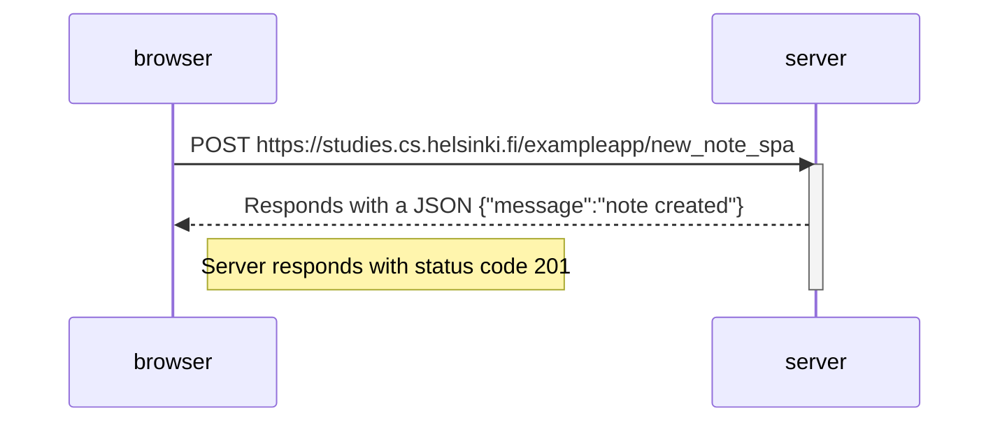

```mermaid
sequenceDiagram
    participant browser
    participant server

    browser->>server: POST https://studies.cs.helsinki.fi/exampleapp/new_note_spa
    activate server
    server-->>browser: Responds with a JSON {"message":"note created"}
     Note right of browser: Server responds with status code 201
    deactivate server

```